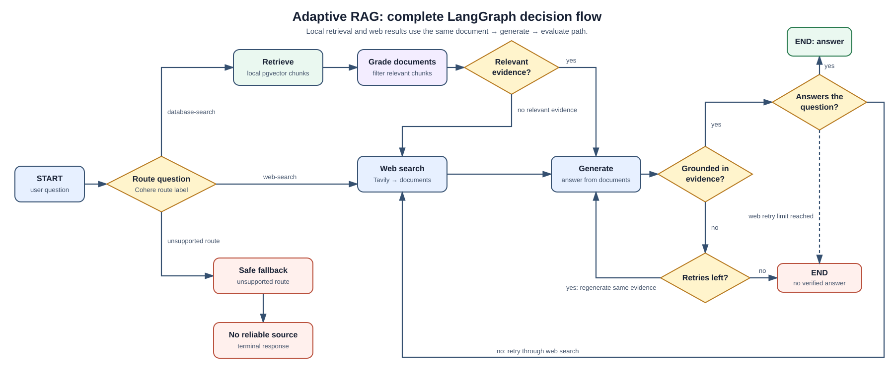

## What is this technique?

Adaptive RAG chooses a retrieval path based on the question and then checks
the quality of its answer. Rather than treating every question as a local
vector-search question, it routes the request to the local database, web
search, or a safe fallback. Local documents are relevance-graded before use.
After generation, the system verifies that the answer is grounded in its
documents and that it actually answers the question. In this project, the
implementation is in `adaptive_rag.py` and
`langgraph/adaptive_rag_graph.py`.

## How a Query Works (Diagram)

## Real-Life Example

Imagine a learning application whose local database contains RAG papers and
notes on HyDE, ReAct, Self-RAG, CRAG, and Adaptive RAG.

1. A user asks, “How does Self-RAG decide whether to retrieve?”
2. The router recognizes the question as a local-corpus topic and uses
   PostgreSQL vector retrieval.
3. The graph grades retrieved chunks and generates from only those that are
   relevant.
4. It checks whether the answer is supported by those chunks and whether it
   answers the user’s question.
5. A user instead asks a current-events question. The router selects Tavily web
   search, converts the results to documents, and uses the same generation and
   evaluation steps.
6. If a check fails, the graph follows a bounded retry path. It does not mark
   an unsupported answer as successful.

## Why This Gives More Precise Results

- It avoids asking a local learning corpus to answer unrelated or current
  questions.
- Document relevance filtering removes distractor context before generation.
- Grounding checks distinguish a plausible answer from one supported by the
  supplied evidence.
- Usefulness checks catch answers that are grounded but fail to address the
  actual question.
- The same document shape is used for local chunks and web results, keeping
  answer-generation logic consistent.

## When to Use It

- Use it when a product has more than one trustworthy information source.
- Use it when some questions are about a curated corpus and others need fresh
  web information.
- Use it when answer quality justifies routing, grading, and evaluation calls.

## Trade-offs

- Routing and answer checks add latency and model cost compared with fixed RAG.
- A wrong routing decision can send the question to a weaker source.
- Web search requires a separate API, current-source evaluation, and careful
  handling of untrusted page text.
- Retry limits are required to prevent a failed generation from looping
  forever.

## Source

- [LangGraph Adaptive RAG Cohere example](https://github.com/langchain-ai/langgraph/blob/main/examples/rag/langgraph_adaptive_rag_cohere.ipynb)
