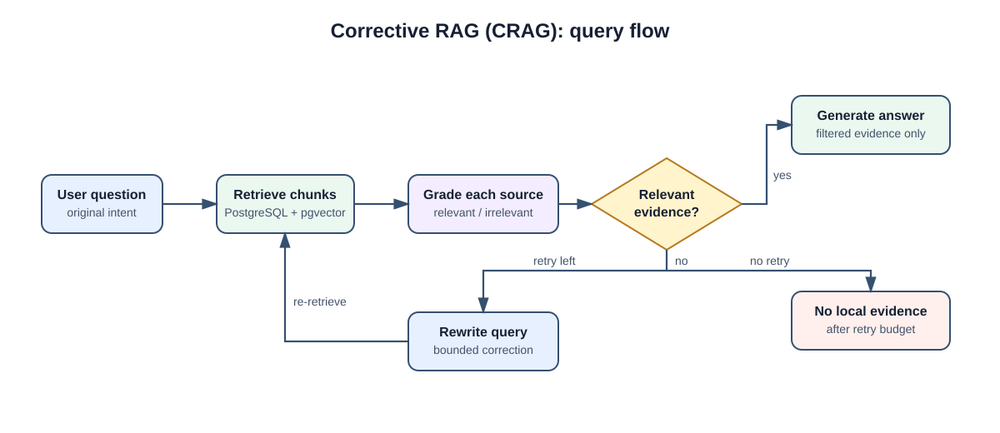

## What is this technique?

Corrective RAG (CRAG) checks whether retrieved documents are useful before it
uses them to answer. Normal RAG retrieves chunks and immediately sends them to
the LLM. CRAG grades each chunk for relevance, keeps only the useful ones, and
tries a clearer search query when every retrieved chunk is off-topic. In this
project, the implementation is in `corrective_rag.py` and
`langgraph/corrective_rag_graph.py`.

## How a Query Works (Diagram)

## Real-Life Example

Imagine a team has a knowledge base containing RAG papers, implementation
notes, and agent tutorials.

1. A user asks, “How does CRAG fix a poor search result?”
2. PostgreSQL returns four chunks that are semantically similar to the question.
3. CRAG asks the LLM to grade each chunk independently.
4. It removes a general RAG chunk and retains chunks about relevance grading
   and query rewriting.
5. The answer LLM receives only the retained evidence and answers the original
   user question.
6. If all four chunks are irrelevant, CRAG rewrites the retrieval query once
   and searches again. If the second search still has no relevant evidence, it
   says the local corpus has no answer rather than guessing.

## Why This Gives More Precise Results

- Irrelevant retrieved chunks are removed before answer generation.
- Each relevance decision is visible in the returned `attempts` record and in
  LangSmith tracing.
- The original question remains the question answered, even if a rewritten
  query improves retrieval.
- A bounded correction loop avoids endless retries and unpredictable cost.

## When to Use It

- Use it when vector search often returns chunks with shared vocabulary but the
  wrong meaning.
- Use it for technical, policy, or support corpora where answer evidence must
  be easy to inspect.
- Use it when one extra retrieval attempt is an acceptable latency trade-off
  for better evidence quality.

## Trade-offs

- It adds one relevance-grading LLM call for every retrieved chunk.
- A grader can mistakenly discard a useful chunk, reducing recall.
- Query rewriting only helps when the corpus contains relevant material under
  different terminology.
- This local implementation does not automatically use web search; PostgreSQL
  remains its source of truth.

## Source

- [Corrective Retrieval Augmented Generation paper](https://arxiv.org/abs/2401.15884)
- [LangGraph CRAG example](https://github.com/langchain-ai/langgraph/blob/main/examples/rag/langgraph_crag.ipynb)
