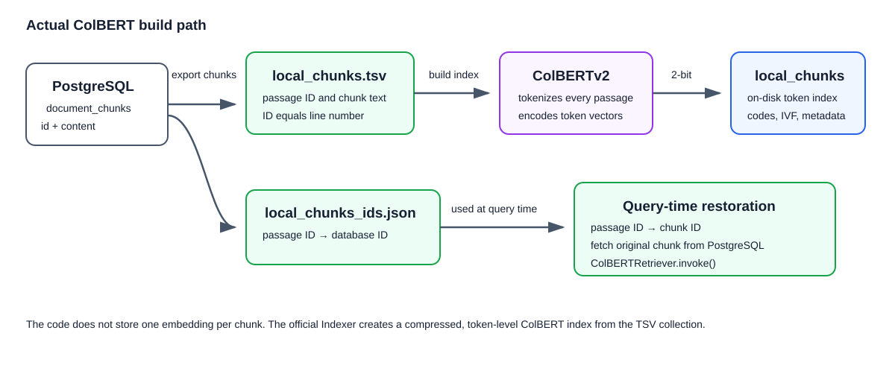
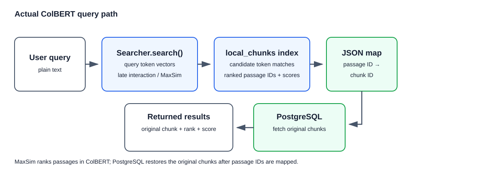

## What is this technique?

ColBERT is a way to search documents by looking at important words separately. Instead of giving one whole chunk one number-list, it stores information for many words in that chunk. When someone asks a question, ColBERT checks which stored words match the question words best. It adds those strong matches and returns the best chunks. In this project, the real code is in `colbert.py` and `colbert_retriever.py`.

## How Indexing Works (Diagram)

## How a Query Works (Diagram)

## Real-Life Example

Imagine a company uploads 10,000 product manuals and policies.

1. The upload process splits the PDFs into chunks and stores them in `document_chunks` in PostgreSQL.
2. You run the ColBERT build command. It exports the chunks to a TSV file, saves a passage-ID map, and creates local ColBERT index files.
3. A user asks, “What is ColBERT?”
4. ColBERT searches its local token index and returns the best passage IDs with scores.
5. The application uses the saved map to turn those passage IDs back into database chunk IDs.
6. PostgreSQL returns the original chunks, and the LLM reads those chunks plus the question to write an answer.

## Why This Gives More Precise / Faster Results

- It can notice one important word, even if the rest of a chunk talks about something else.
- It gives a higher score when a chunk matches several parts of the question.
- The local index is compressed so searching it is practical for a large collection.
- The database only returns the original text after ColBERT has found the best IDs.

## When to Use It

- Use it when precise terminology matters, such as technical or legal search.
- Use it when improved retrieval quality is worth more index storage than ordinary vector search.
- Use it for a medium or large collection with ColBERT-compatible compute available.

## Trade-offs

- Many token vectors make the index larger than one-vector-per-chunk search.
- Search needs the ColBERT package and its supported model/runtime environment.
- Rebuilding exports all current database chunks before recreating the on-disk index.

## Source

- [LangGraph RAG examples](https://github.com/langchain-ai/langgraph/tree/main/examples/rag)
