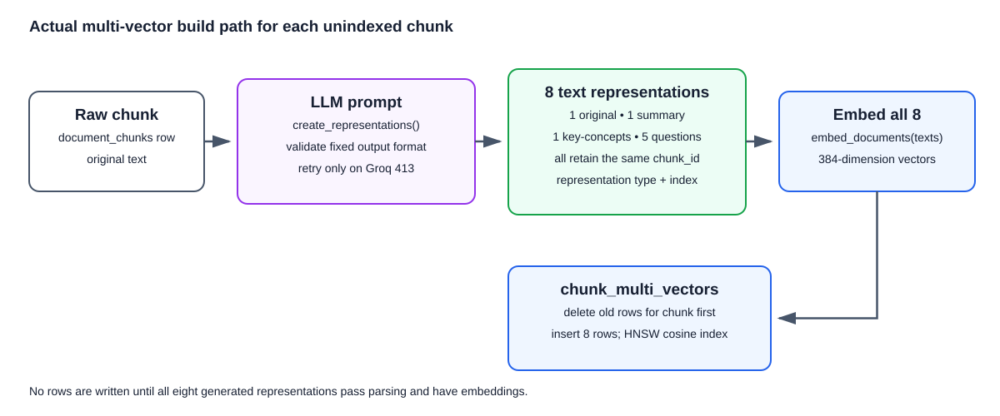
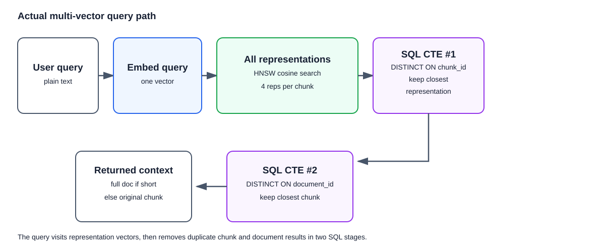

## What is this technique?

Multi-vector retrieval gives one chunk several ways to be found. In this project, every chunk keeps its original text, a short summary, key concepts, and five questions it could answer. Each version has its own vector, but all versions point back to the same original chunk. When a user searches, the best matching version chooses the score for that chunk. This helps when people ask the same thing using different words.

## How Indexing Works (Diagram)

## How a Query Works (Diagram)

## Real-Life Example

Imagine a company uploads 10,000 customer-support PDFs.

1. The PDFs are split into chunks and stored in `document_chunks`.
2. You run the multi-vector indexing command for chunks that do not yet have extra representations.
3. For each chunk, the LLM creates a summary, key concepts, and five likely questions; together with the original text, that makes eight searchable versions.
4. A user asks, “How do I reset my account password?”
5. PostgreSQL searches all eight versions, keeps the best version for each chunk, then keeps the best chunk for each document.
6. The application returns the right chunk or short document to the LLM, which writes the final answer.

## Why This Gives More Precise / Faster Results

- A summary or likely question can match user wording that does not appear in the original chunk.
- The system keeps one best match per chunk, so one chunk does not appear many times.
- It then keeps one best chunk per document, so the answer step gets less duplicate text.
- HNSW makes searching all of the stored versions fast enough for a larger collection.

## When to Use It

- Use it for support or knowledge-base search where people phrase the same need in different ways.
- Use it when higher recall is worth additional index-time LLM and embedding work.
- Use it before a final reranker or answer step.

## Trade-offs

- Eight vectors per chunk increase storage and embedding cost.
- Generated representations can be misleading if the model makes a poor summary or question.
- Indexing is slower because it waits for LLM generation and stores every representation.

## Source

- [LangGraph RAG examples](https://github.com/langchain-ai/langgraph/tree/main/examples/rag)
