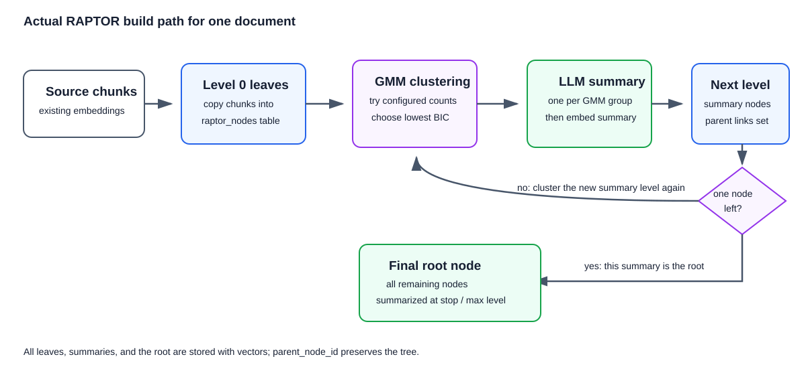
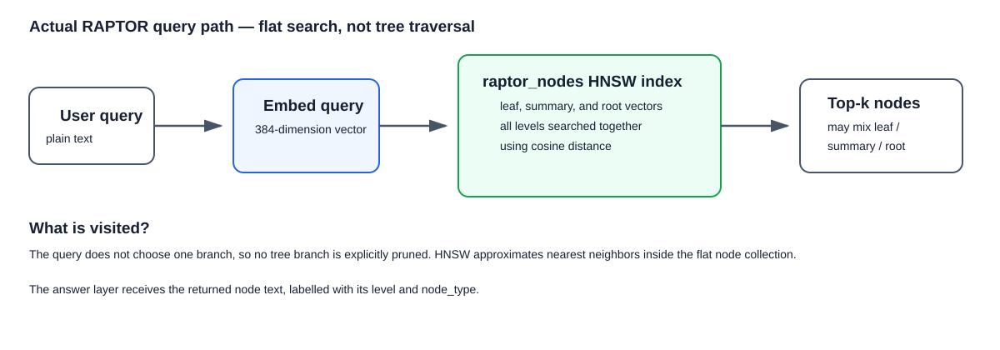

## What is this technique?

RAPTOR turns a long document into a tree of small pieces and short summaries. The original chunks stay at the bottom of the tree. Related chunks get a summary, and related summaries get another summary until there is one top summary. In this project, search checks both the original chunks and the summaries. This means it can find a small detail or a big-picture explanation.

## How Indexing Works (Diagram)

## How a Query Works (Diagram)

## Real-Life Example

Imagine a company uploads 10,000 long research reports.

1. The reports are split into chunks and stored in the database with embeddings.
2. You run the RAPTOR build command. It copies chunks as tree leaves, groups similar leaves, writes summaries, and repeats this for the next level.
3. Each document ends with a root summary above its detailed chunks.
4. A user asks, “What are the main risks in this report?”
5. RAPTOR searches the vectors for leaves, summaries, and roots together, then returns the best matching nodes.
6. The LLM can use a returned summary for the overview and returned chunks for the supporting details.

## Why This Gives More Precise / Faster Results

- A summary can answer a broad question about a whole section or document.
- An original chunk can answer a question that needs an exact detail.
- One search can return both an overview and detailed evidence.
- The HNSW index helps PostgreSQL avoid checking every tree node one by one.

## When to Use It

- Use it for long documents with both broad and detailed questions.
- Use it when answer generation benefits from a summary plus supporting source chunks.
- Use it when extra LLM work during indexing is acceptable.

## Trade-offs

- Building summaries requires extra model calls, storage, and indexing time.
- A poor summary may become a poor retrieval result.
- Changing source content may require rebuilding the affected document tree.

## Source

- [LangGraph RAG examples](https://github.com/langchain-ai/langgraph/tree/main/examples/rag)
